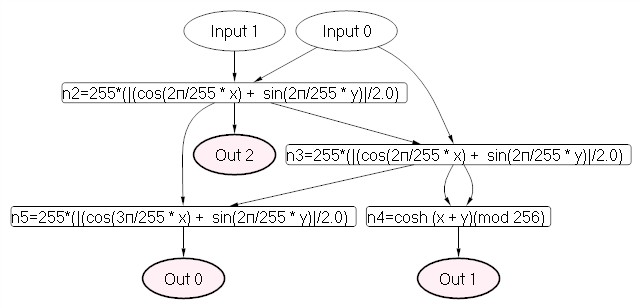
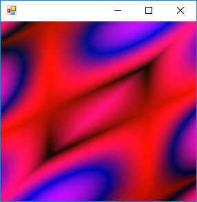
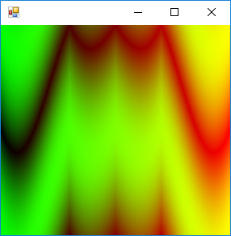
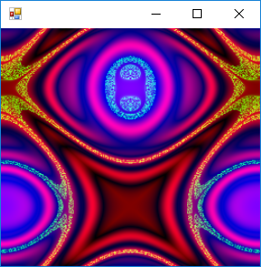
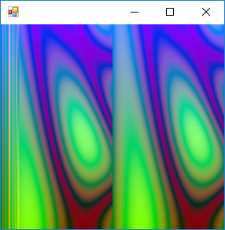

# FsCgp
An F# library for Cartesian Genetic Programming.

See [Chapter 2. Cartesian Genetic Programming. Julian F. Miller.](https://www.springer.com/cda/content/document/cda_downloaddocument/9783642173097-c2.pdf) for a comprehensive tuturial.

## Function graph visualization

- 

## Generative art examples
-    

-   

-   

-   